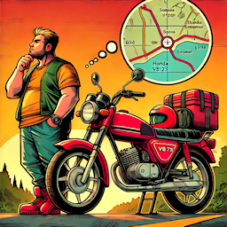
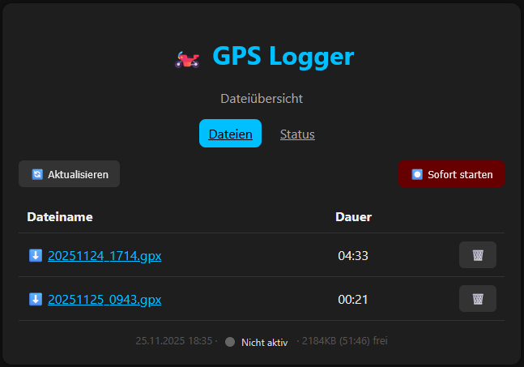
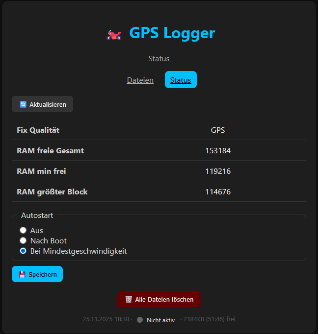

# GPX Logger

**Projekt**
- **Beschreibung**: Ein einfacher GPS-Logger zum Einbau in Fahrzeuge, der GPS‑Positionen binär im LittleFS speichert, über ein eingebettetes Web‑UI verwaltet, und bei Download "on the fly" ins *.gpx Format umwandelt.

Der (Async-)Webserver, gedacht fürs Mobiltelefon, bietet Tourenliste, Download- und Steuerfunktionen.
Normalerweise sollte der Logger eine "black box" sein und in einem Autostart Modus laufen. Eine Bedienung über die UI ist nur dann notwendig wenn eine GPX Datei heruntergeladen oder gelöscht werden soll.

* Es gibt die Modi:
   * Kein Autostart
   * Autostart nach Einschalten
   * Autostart nach Erreichen einer Mindestgeshwindigkeit (Default 5km/h)
   * Manueller Start oder Stop.

(Alles sobald ein GPS-FIX empfangen wurde).

**Es ist kein Batteriepuffer notwenig.** Einfach über einen USB-Lader an Zündungsplus (aka "Klemme 15") anschließen. Nach einer Fahrtpause (Zündung aus) wird überprüft ob eine kürzlich erstellte Datei vorhanden ist, und diese ggf. fortgesetzt (Konfigurierbar).

Der ESP-C3 ist so klein, dass er nicht zählt und die Größe wird durch den GPS-Empfänger bestimmt. (Ich habe beides, und die Antenne, in eine größere TicTac Dose eingebaut. Passt sammt Stromversorgung unter den Sitz meines Bikes.)

Mit 4MB Flash beträgt die Speicherzeit durch Datenkomprimierung über **200 Stunden** (LittleFS). Bei Modellen mit mehr Flash sollte die `partitions.csv` gewechselt werden.

**Hardware & Anforderungen**
- **Board**: ESP32-kompatibles Board.
- **GPS-Modul**: Serielles GPS (konfigurierbar in `config.h`).
- **Build-Tool**: PlatformIO (Install: https://platformio.org).

**Verdrahtung**
- Strom über einen USB-Lader oder Modul an die USB-Buchse oder die 5V Pins.
- Das GPS-Modul an GND und die Serielle Schnittstelle anschließen. (Getestet mit UBLOX M8.)

Die Tx(ESP) -> Rx(GPS) ist optional und wird derzeit nur bei UBLOX benutzt.

**Projektstruktur (wichtigste Dateien)**
- **`data/web/`**: Web-Assets (HTML/CSS/JS), z.B. `index.html`, `status.html`, `script.js`, `style.css`.
- **`src/`**: Firmware-Quellcode (`main.cpp`, `web.cpp`, ...).
- **`include/`**: Header-Dateien (`config.h`, ...).

**Build**
- In pioarduino:
  1. copy include/credentials.h.example to include/credentials.h and edit the SSID and Password
  2. Build Filesystem Image
  3. Upload Filesystem Image
  4. Build and Upload Program

**Web-Oberfläche**
- **Dateien**: Öffne `http://gps.local/` oder über den Access Point mit `http://192.168.4.1/`
- **Seiten**:
  - `index.html` — Dateiliste & Aktionen (Refresh, Log starten/stoppen).
  - `status.html` — Status & erweiterte Steuerung (z. B. LogMode speichern).

**Projektkonfiguration**
- Alle Einstellungen wie WLAN, GPS-Pins etc. stehen in `include/config.h`.
- Persistente Log-Optionen werden mittels `Preferences` (NVS) gespeichert — z. B. `logMode`.

